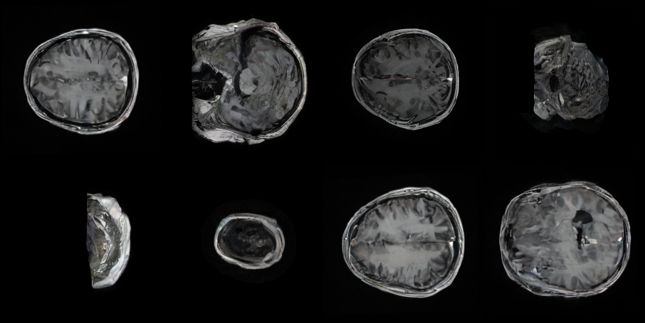

# Diffusion Transformer in Pairwised MRI-CT translation

## Objective
In this project, Diffusion Transformer (https://arxiv.org/pdf/2212.09748) is implemented for pairwised CT-MRI translation task.

 Generated MRI images by Diffusion Transformer DiT-L-2 
